# Roadmap — First Game Tutorial (POC: walk + jump in a 3D pixel-art room)

> Source material: "2D to 3D in Godot" overview (adapted) + "3D Pixel Art" tutorial.
> This roadmap is the framework's first end-to-end validation: every phase is executed
> by skills, gated by observable verification, and recorded in `CLAUDE.md`.
> **Divergences from source:** orthographic fixed-angle camera (not first-person
> perspective); lighting tuned for pixel readability (no ACES/auto-exposure/SSAO);
> Jolt physics enabled from day one (Godot 4.4+ project setting).

## Roadmap graph

```mermaid
flowchart TD
    P0["Phase 0 — Foundation<br/><b>godot-project-conventions</b><br/>renderer, folders, input map,<br/>Jolt physics, CLAUDE.md contract"]
    P1["Phase 1 — Render pipeline<br/><b>godot-3d-pixelation</b><br/>SubViewport, stretch_shrink,<br/>nearest filtering"]
    P2["Phase 2 — Camera<br/><b>godot-camera-rig</b><br/>orthographic, fixed -30°/45°,<br/>smooth follow"]
    P3["Phase 3 — Level blockout<br/><b>godot-csg-blockout</b> 🔨<br/>CSG boxes, snapping, subtraction,<br/>combiner, use_collision"]
    P4["Phase 4 — Player<br/><b>godot-player-controller-3d</b> 🔨<br/>CharacterBody3D, camera-relative<br/>move, jump, capsule placeholder"]
    P5["Phase 5 — Light &amp; environment<br/><b>godot-lighting-environment</b> 🔨<br/>sun + shadows (depth cue),<br/>WorldEnvironment, sky color"]
    GATE{"POC GATE<br/>walk + jump, pixelated,<br/>camera follows — F5 pass"}
    P6["Phase 6 — Outline shaders<br/><b>godot-postprocess-quad</b> ✅<br/><b>godot-screen-textures</b> ✅<br/>godot-edges-depth 📋<br/>godot-edges-normal 📋<br/>godot-outline-compositing 📋"]
    P7["Phase 7 — Real assets<br/>godot-asset-import 📋<br/>glTF nested scenes, external<br/>materials, collision suffixes"]
    P8["Phase 8 — Characters &amp; animation<br/>godot-animation-libraries 📋<br/>rigs, AnimationPlayer, retargeting"]

    P0 --> P1 --> P2 --> P3 --> P4 --> P5 --> GATE
    GATE --> P6
    GATE --> P7 --> P8
    P6 -.->|"style polish"| P7

    classDef done fill:#1a7f37,color:#fff,stroke:#1a7f37
    classDef next fill:#9a6700,color:#fff,stroke:#9a6700
    classDef planned fill:#57606a,color:#fff,stroke:#57606a
    classDef gate fill:#cf222e,color:#fff,stroke:#cf222e
    class P0,P1,P2 done
    class P3,P4,P5 next
    class P6,P7,P8 planned
    class GATE gate
```

Legend: green = skill built ✅ · amber = next to build 🔨 · gray = planned 📋 · red = verification gate

## Phase table

| Phase                 | Skill(s)                                                                                | Status   | Gate (observable, F5-testable)                                                |
| --------------------- | --------------------------------------------------------------------------------------- | -------- | ----------------------------------------------------------------------------- |
| 0 Foundation          | godot-project-conventions                                                               | ✅ built | CLAUDE.md has conventions section; project runs empty; Jolt enabled           |
| 1 Render pipeline     | godot-3d-pixelation                                                                     | ✅ built | Scene visibly pixelated at stretch_shrink 4; crisp (nearest) edges            |
| 2 Camera              | godot-camera-rig                                                                        | ✅ built | Orthographic view, no vanishing point; Size zooms, Z-move doesn't             |
| 3 Level blockout      | godot-csg-blockout                                                                      | 🔨 next  | ~20×20 floor, walls, 2–3 platforms of varying height, all collidable          |
| 4 Player              | godot-player-controller-3d                                                              | 🔨 next  | Capsule walks camera-relative, jumps onto lowest platform, can't leave room   |
| 5 Light & environment | godot-lighting-environment                                                              | 🔨 next  | Sun shadows visible under player (jump landing readable); no blown highlights |
| **POC**               | —                                                                                       | gate     | All of the above in one F5 run, recorded as pass/fail per phase               |
| 6 Outlines            | postprocess-quad ✅, screen-textures ✅, edges-depth, edges-normal, outline-compositing | partial  | Single-pixel outlines, bright/dark params adjustable                          |
| 7 Assets              | godot-asset-import                                                                      | 📋       | Graybox swapped for glTF props via nested scenes; collisions intact           |
| 8 Characters          | godot-animation-libraries                                                               | 📋       | Animated character with looping idle from a separate animation file           |

## Conventions adopted from source material (apply in Phase 0)

- **Jolt physics**: Project Settings → Physics → 3D → Physics Engine = Jolt (Godot 4.4+).
- **Scene structuring rule**: game scenes **nest** imported models; never inherited
  scenes, never "make local" (scene bloat). Record in CLAUDE.md.
- **Graybox discipline**: blockout with CSG + snapping first; replace with assets only
  after the POC gate. Lock + de-collide CSG when swapping (Phase 7).
- **1 unit = 1 meter**; collider scaling must stay uniform.

## Explicitly out of scope (do not let agents drift into these)

Terrain tools, first-person/perspective controllers, ACES/AgX tonemapping,
auto-exposure, SSAO, particle VFX, animation retargeting (until Phase 8),
sound, UI, save/load.
